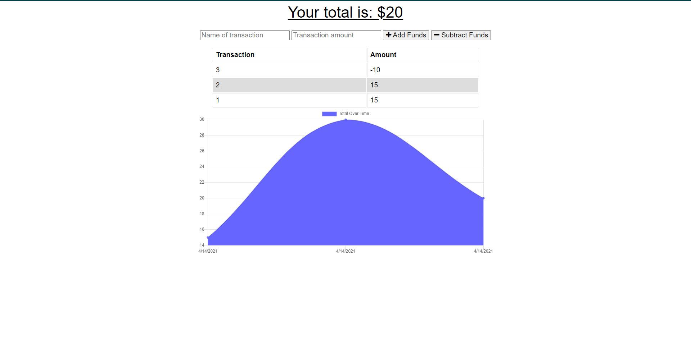

# Budget Tracker

## Table of Contents
1. [Description](#Description)
2. [Installation](#Installation)
3. [Usage](#Usage)
4. [License](#License)
5. [Contributing](#Contributing)
6. [Questions](#Questions)

## Description
This Progressive Web Application has offline functionality to allow users to update their budget based on income and expenses. MongoDB is used on the backend with IndexedDB providing browser support.

## Installation
In order to install the application, follow these steps: 

Go to the link: https://unc-budget-tracker.herokuapp.com/

## Usage
This application can be downloaded as a PWA

## License
This application is not protected under a license

## Contributing
NA

## Tests
In order to test the application, follow these steps:

NA

## Questions
You can find my other applications on my github page
Github: [mautrey17](https://github.com/mautrey17) 

Or you can email me at: mautrey17@gmail.com

# Budget Tracker

## Table of Contents
1. [Description](#Description)
2. [Installation](#Installation)
3. [Usage](#Usage)
4. [License](#License)
5. [Contributing](#Contributing)
6. [Questions](#Questions)

## Description
This application has offline functionality to allow users to update their budget based on income and expenses. MongoDB is used on the backend with IndexedDB providing browser support

## Installation
In order to install the application, follow these steps: 

Go to the link

## Usage
This application can be downloaded as a PWA

## License
This application is protected under No license

## Contributing
NA

## Tests
In order to test the application, follow these steps:

NA

## Questions
You can find my other applications on my github page
Github: [mautrey17](https://github.com/mautrey17) 

Or you can email me at: mautrey17@gmail.com
